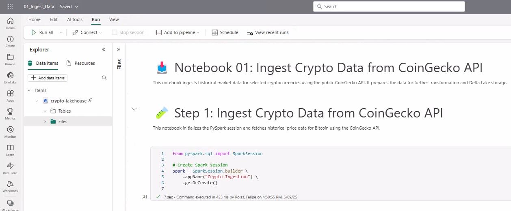
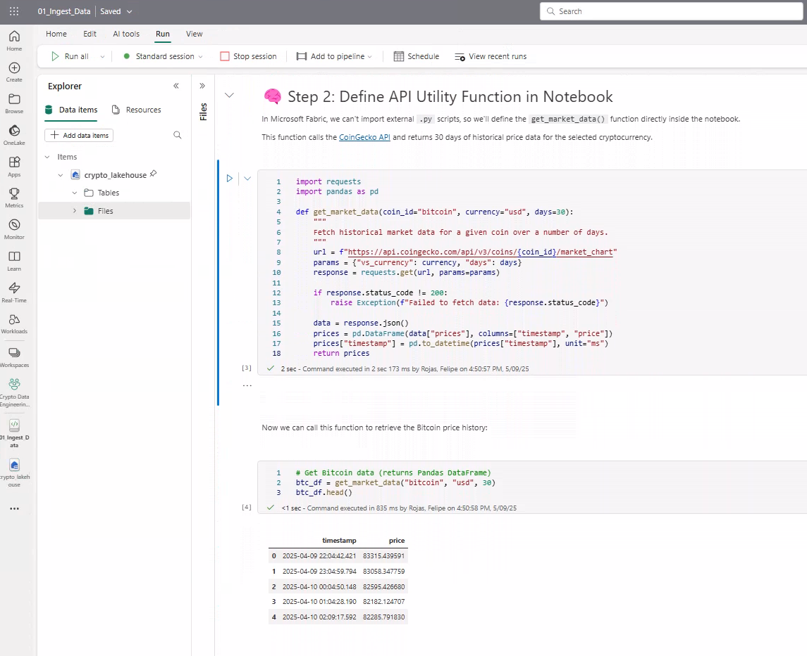
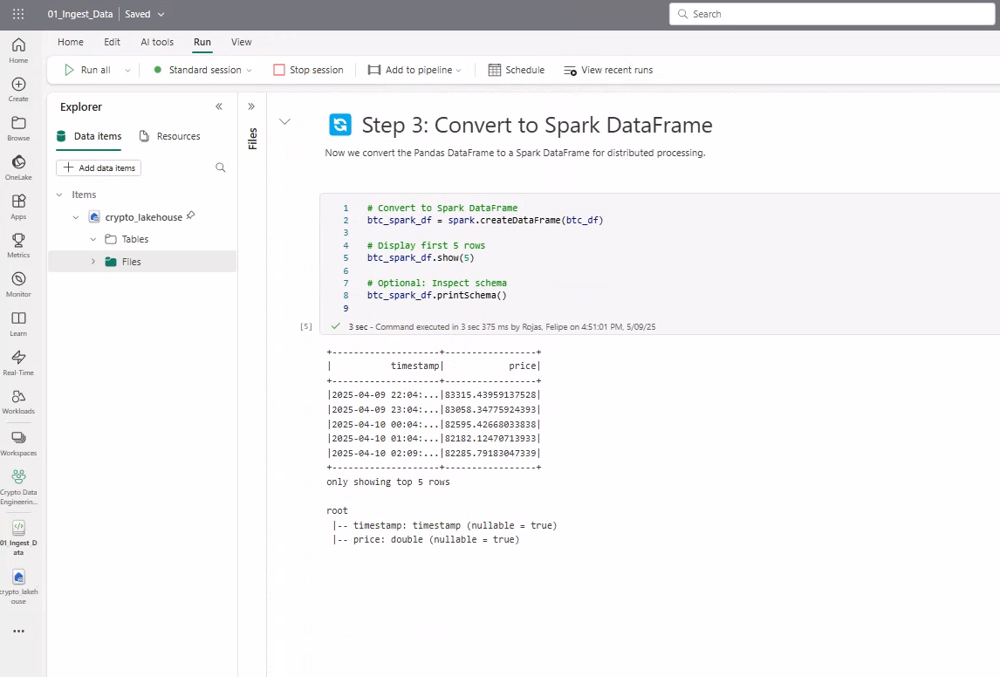
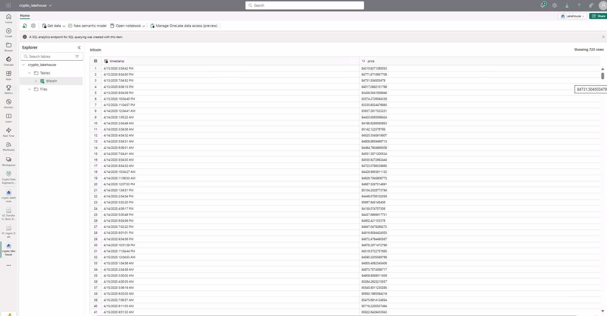

# 🚀 Delta Lake Crypto Pipeline

This PySpark project builds a modern Delta Lake pipeline to ingest cryptocurrency data from the CoinGecko API, clean and transform it using Apache Spark, and store it in Delta format using Microsoft Fabric.

---

## 📌 Problem Statement

Real-time crypto data is highly valuable for traders and analysts, but handling large volumes of time-series data efficiently requires scalable pipelines. This project demonstrates a modern ingestion pipeline using Delta Lake for fast and reliable data analysis.

---

## 📦 Data Source

- **API**: [CoinGecko Public API](https://www.coingecko.com/en/api)
- **Data**: Top cryptocurrencies with market data, price history, and trading volumes.

---

## 🛠️ Tech Stack

- PySpark
- Delta Lake
- Microsoft Fabric (Lakehouse)
- Git & GitHub

---

## 🔁 Pipeline Overview

1. Ingest crypto data from CoinGecko API using PySpark
2. Transform and flatten nested JSON structures
3. Store cleaned data in Delta format
4. Enable querying via Spark SQL on Fabric Lakehouse

---

## 🧪 Notebook Execution Screenshots

### 📝 Notebook 1: Ingest Data

**1. Initialize Spark Session**  


**2. Define API Function in Notebook**  


**3. Convert to Spark DataFrame**  


---

### 🧹 Notebook 2: Transform and Save

**4. Save Cleaned Data to Delta Table**  


**5. Verify Bitcoin Table in Lakehouse Explorer**  


---

## 📁 Project Structure

```
delta-lake-crypto-pipeline/
├── notebooks/
│ ├── 01_Ingest_Data.ipynb
│ └── 02_Transform_Store_Delta.ipynb
├── src/
│ └── api_utils.py
├── images/
│ ├── 1_notebook1_ingest_session_start.png
│ ├── 2_notebook1_define_api_function.png
│ ├── 3_notebook1_convert_to_spark_df.png
│ ├── 4_notebook2_save_delta_table.png
│ └── 5_lakehouse_explorer_bitcoin_table.png
├── README.md
```

---

## 🚀 Key Features

- End-to-end Delta Lake pipeline built with PySpark  
- API ingestion with real-time crypto data (CoinGecko)  
- Flattening and transforming nested JSON to tabular format  
- Delta format storage on Microsoft Fabric Lakehouse  
- Query-ready tables using Spark SQL  

---

## 🏅 Author & Certifications

**Felipe Castro**  
Analytics Engineer @ EPAM Systems  

📜 [PL-300: Power BI Data Analyst](https://learn.microsoft.com/api/credentials/share/en-us/FelipeCastro-8026/F853AABE365874B3?sharingId=13D660F56C1DFFA3)  
📜 [DP-600: Fabric Analytics Engineer](https://learn.microsoft.com/api/credentials/share/en-us/FelipeCastro-8026/6C5A2F5A8A5864FC?sharingId=13D660F56C1DFFA3)  
📜 [DP-700: Fabric Data Engineer](https://learn.microsoft.com/api/credentials/share/en-us/FelipeCastro-8026/96572499DF943EBC?sharingId=13D660F56C1DFFA3)
